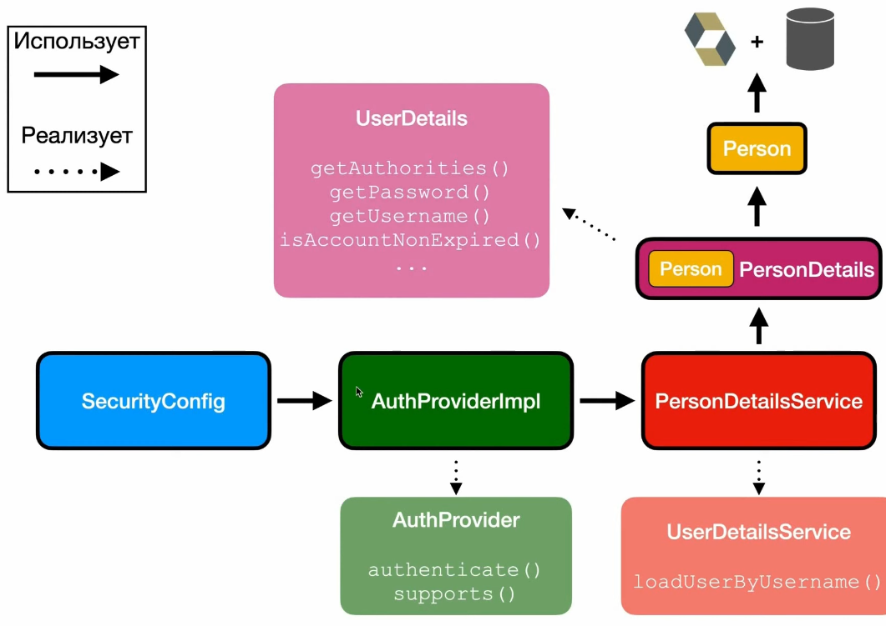

# Spring JPA Demo

Sandbox for JPA POCs

## References

- Maven docker plugin - <https://github.com/fabric8io/docker-maven-plugin>
- Logback config - <https://javatechonline.com/logback-xml-configuration-examples/>
- Prepare tomcat for production - <https://contabo.com/blog/apache-tomcat-complete-guide-to-setup-and-configuration/>
- Regex Cheatsheet <https://www.rexegg.com/regex-quickstart.php>
- JPA Query Methods <https://docs.spring.io/spring-data/jpa/reference/jpa/query-methods.html>
- <https://jwt.io/>
- <https://www.baeldung.com/kafka-consumer-offset>
- Gradle spring boot multimodule <https://tmsvr.com/gradle-multi-module-build/>
  - <https://github.com/tmsvr/tmsvr-blog/blob/master/multi-modules/service/build.gradle>

## Prerequisites and setup

1. jdk-21, docker, docker-compose
2. Run `docker-compose -f ./docker/dbs-docker-compose.yaml  up -d`
3. `mvnw -f ./spring-jpa-demo-parent/pom.xml clean install -DskipTests`
4. To test a module like `demo1-liquibase`
   1. run manually `src/main/scripts/mysqlusers.sql`
   2. run tests from that module

## Connect

```sh
docker exec -it postgres_demo bash
docker exec -it mysql_demo bash

mysql -h localhost -P 3306 --protocol=tcp -u root -p'qwerty' -D demo_db
psql -h localhost -p 5432 -U postgres -d demo_db

# -W - to input the password
psql -h 192.168.0.97 -p 5432 -U superadmin -d postgres -W
```

## Setup IDE

1. For **IntelliJ** add **Adapter for Eclipse Code Formatter**
2. Add eclipse formatter config
3. Add import order file

## Maven

```sh
# generate child module
# for webapp use: org.apache.maven.archetypes:maven-archetype-webapp
mvnw -f ./pom.xml archetype:generate -DarchetypeGroupId=org.apache.maven.archetypes -DarchetypeArtifactId=maven-archetype-quickstart -DarchetypeVersion=1.4 -DgroupId=com.ipostu.service.module -DartifactId=service-module

mvnw -f ./spring-jpa-demo-parent/pom.xml clean install -DskipTests

mvnw -f ./spring-jpa-demo-parent/demo16-springboot-docker-layers/pom.xml clean package -DskipTests

# dependency tree
projectName=demo-spring4-war-annotation && mvnw -f ./$projectName/pom.xml dependency:tree
```

## VM Tomcat deploy (dev env)

```sh
# on VM
nix-shell -p jdk17
nix-shell -p postgresql_16

# host machine
projectName=demo-spring11-jar-boot \
  && mvnw -f ./$projectName/pom.xml clean package \
  && mkdir -p ~/VMSharedD12/_depl \
  && cp -r ./$projectName/target/$projectName ~/VMSharedD12/_depl/$projectName \
  && touch ~/VMSharedD12/_depl/signal1.txt

#############################################
# bash script file pool-artifact.sh
#!/bin/bash

export CATALINA_HOME=/home/test/apache-tomcat-10.1.35
SIGNAL_FILE=~/Desktop/sharedWithHost/_depl/signal1.txt

deploy_war_files() {
  echo "Running: catalina.sh stop"
  $CATALINA_HOME/bin/catalina.sh stop

  echo "Cleaning: $CATALINA_HOME/webapps/*"
  rm -rf $CATALINA_HOME/webapps/*

  echo "Copying: ~/Desktop/sharedWithHost/_depl to $CATALINA_HOME/webapps"
  cp -r ~/Desktop/sharedWithHost/_depl/* $CATALINA_HOME/webapps

  echo "Running: catalina.sh start"
  $CATALINA_HOME/bin/catalina.sh start
}

while true; do
  if [ -f $SIGNAL_FILE ]; then
    rm $SIGNAL_FILE
    deploy_war_files
    rm -rf ~/Desktop/sharedWithHost/_depl
  fi

  sleep 0.5
done
```

## Observations

- Maven surefire plugin doesn't see non-public test classes as well as non-public test class methods
- logback.xml
  - if `${catalina.home}` is undefined, it will create `catalina.home_IS_UNDEFINED` in the path where the program is run
- CRUD
  - GET /posts
  - POST /posts
  - GET /posts/new
  - GET /posts/:id/edit
  - GET /posts/:id
  - PATCH /posts/:id
  - DELETE /posts/:id
- REST (representational state transfer)
  - GET /posts
  - GET /posts/:id
  - POST /posts
  - PATCH /posts/:id
  - DELETE /posts/:id
- The `<form />` in html only supports: GET and POST, but in order to do all kind of requests spring uses `HiddenHttpMethodFilter`
- Configure postgres on VM with Debian 12 with nix-shell
  - `nix-shell -p postgresql_16`

  - `initdb -D ./pgdata`
  - `sudo chown test /run/postgresql`
  - `sudo chown <user> /run/postgresql`
  - `pg_ctl -D ./pgdata -l logfile start`
  - `psql -d postgres` connect via postgres user
  - `CREATE ROLE superadmin WITH SUPERUSER CREATEDB CREATEROLE LOGIN PASSWORD 'qwerty';`
  - `psql -U superadmin -d postgres -W`
    - `pg_hba.conf`

    ```sh
      # IPv4 local connections
      host all all 0.0.0.0/0 scram-sha-256
      # IPv6 local connections
      host all all ::/0 scram-sha-256
    ```

  - `pgdata/postgresql.conf` -> `password_encryption = scram-sha-256`
  - Enable remote TCP connections, edit `pgdata/postgresql.conf` - from `listen_addresses='localhost'` to `listen_addresses='*'`
  - `pg_ctl -D ./pgdata -l logfile restart`
  - restart postgres process
    - `sudo pkill -e postgre`
    - `sudo chown -R test: /run/postgresql`
    - `pg_ctl -D ./pgdata -l logfile restart`

- Virtualbox VM
  - Networking: NAT -> Bridged Adapter - expose VM to network
  - Run on guest OS `ip addr` and use this ip in host OS
- `DriverManagerDataSource` spring's implementation of `DataSource` which creates a new connection when `getConnection` is called
- `jdbcTemplate.batchUpdate` 1000x more optimized that inserting/updating records in loop
- In postres (and any other RDMS) `SELECT * FROM ...` without explicit order return records by order of insertion BUT `UPDATE` query breaks this order, so the only one guarantee of order is with explicit `ORDER BY`
- There is a way to define custom `jakarta.validation` annotations with custom logic, the impl. is used automatically, client code should only use annotation
  - To use spring beans, it is necessary to use a different approach, a custom bean which implements `org.springframework.validation.Validator`, the bean should be used manually (no annotations)
- Thymeleaf template engine by default doesn't support `UTF-8`, it is needed to run `new ThymeleafViewResolver().setCharacterEncoding("UTF-8")`
- To use hibernate, add jdbc driver, hibernate-core and `hibernate.properties`
- Hibernate usage: create hibernate `Configuration` instance (internally reads `hibernate.properties`), create `sessionFactory` (expensive op.), create session, `session.beginTransaction(); op. session.getTransaction().commit();`
- Hibernate caches items inside the transaction
- It is required in case of OneToMany to set item on both sides in order to avoid cache inconsistencies, e.g. Person -> List<Items>, if a new item is created, `person.getItems().add(item); item.setPerson(person);`
- Hibernate life-cycles:
  - Transient - entity type object created by client code, becomes Persistent after `session.save(entityObject)`
  - Persistent (Managed) - `session.get` is Persistent, in other words if client code calls setters, then hibernate will notice it and will execute related sql on `session.getTransaction().commit()`
  - Detached - `session.detach` or when `session` is closed, can be linked to Persistent Context through `session.merge(...)`
  - Removed - entity object after `session.remove()`
- Owning side (entity) is an entity which doesn't have @One|ManyToOne|Many(mapedBy="..."), in other words it is the opposite entity
- `fetch = FetchType.LAZY|EAGER`
  - OneToMany and ManyToMany by default are Lazy
  - OneToOne and ManyToOne by default is Eager
- `Hibernate.initialize(person.getItems())` is used to load lazy entities, after this call we can use `person.getItems()` in detached `person`
- Persistence context = Level 1 cache
- Hibernate core(main hibernate dependency) by default provides and implement `javax.persistence.*` renamed to `jakarta.persistence.*` which is JPA specification
- N+1 problem

  ```java
  // 1 Query
  List<Person> people = session.createQuery("SELECT p FROM Person p", Person.class);

  // N Queries
  for(Person person : people) {
    LOG.info("Person {} has: {}", person.getName(), person.getItems());
  }

  // Result:
  // 1 time:  SELECT * FROM person;
  // N times: SELECT * FROM items WHERE person_id=?
  ```

  - `FetchType.EAGER` do not help!
  - Solution 1 - HQL with LEFT JOIN FETCH

    ```java
    List<Person> people = session.createQuery("SELECT p FROM Person p LEFT JOIN FETCH p.items", Person.class);
    ```

- Difference between `session.get` and `session.load`
  - `session.get` does `SELECT ...` on call
  - `session.load` returns a proxy object with only one populated field, `id`, if client code calls any `get` method on the column field, then the proxy will do `SELECT ...`
  - usage of `session.load`

  ```java
  Item item = new Item("...");
  Person personProxy = session.load(id, Person.class);
  item.setOwner(personProxy);
  session.save(item);
  ```

- Spring Data JPA exposes an API for paging and sorting, e.g.:

  ```java
  peopleRepository.findAll(PageRequest.of(0, 20,
          Sort.by(List.of(new Sort.Order(Sort.Direction.DESC, "name"),
                  new Sort.Order(Sort.Direction.DESC, "age")))));
  ```

- `@jakarta.persistence.Transient` tells hibernate to ignore this field
- Build and run spring-boot app:
  - `projectName=demo-spring11-jar-boot   && mvnw -f ./$projectName/pom.xml clean package && java -jar ./demo-spring11-jar-boot/target/demo-spring11-jar-boot-1.0-SNAPSHOT.jar`
  - `projectName=demo-spring11-jar-boot   && mvnw -f ./$projectName/pom.xml  spring-boot:run`
- Spring Security - general
  - client code should implement `AuthenticationProvider`
    - it takes as an input `Authentication+Credentials`
    - returns as an output `Authentication+Principal`
    - `Cookie/Sessions == Map<String, Object>`
    - After successful login, `Principal` is stored in session and linked to cookie which is returned to user
    - Spring security provides a filter which gets by cookie principal object and keeps it in thread local for the current request
- Spring Boot Security Starter
  - By default all mappings are secured, default username is `user`, the password is shown in cli: `Using generated security password: d7d4e2e1-7caf-467c-a54b-4fe48ffc30c9`
- Spring Security

  ```java
  @Component
  public class AuthProviderImpl implements AuthenticationProvider
  ```

  - `AuthenticationProvider` isn't required, spring provides its own one, the client code should only define new one if an additional logic is needed
- CSRF - Cross Site Request Forgery
  - Protection for endpoints that change data, such as PUT/POST/DELETE
  - Backend generates one time token which is injected into the html and is hidden for user
  - On request this token is also added into the body of request and backend verifies it
- Authorization in pring security
  - Authority - allowed action, e.g. `BAN_USER`, `WITHDRAW_MONEY`, `SEND_MONEY`
  - Role `ADMIN`, `USER`
- `.hasRole("ADMIN")` is exactly same as `.hasAuthority("ROLE_ADMIN")`
- `@Controller` can return json response only if method is annotated with `@ResponseBody`, by default it tries to resolve view
  - `@RestController` doesn't require `@ResponseBody`, it returns JSON by default
  - JWT JsonWebToken
    - Header, Payload, Signature

## TODO

- Bean pre|post processor
- AOP xml|java
- Sql stored procedure with transaction & CallableStatement
- Spring web + JaxRS (Jersey)
- grpc
- JPA: column based on `Enum` ordinal|string|custom value (Converter usage)

## Summary

### Spring mvc demo1

#### Demo webapp 1

- Embedded tomcat
- Accessible through: `http://localhost:8080/springapp/app`
- Context initialization via implementing `WebApplicationInitializer`

### spring-jpa-demo-parent - demo1-liquibase

- Liquibase + Spring Boot
- Liquibase is triggered on spring boot startup

### spring-jpa-demo-parent - demo2-flyway

- Flyway (default config) in combination with spring boot

### spring-jpa-demo-parent - demo3-ids

- Different kind of keys (autoincrement, UUID string, UUIDD binary)
- natural vs. surrogate key
- composite keys

### spring-jpa-demo-parent - demo4-jdbc

JDBC usage + flyway config

### spring-jpa-demo-parent - demo5-jdbc-template

JDBC Template

### spring-jpa-demo-parent - demo6-hibernate-dao

JPA EntityManagerFactory/EntityManager and TypedQuery usage

### spring-jpa-demo-parent - demo7-hibernate-queries

JPA EntityManagerFactory/EntityManager and TypedQuery usage

\+ @NamedQuery (query on entity class annotation)

### spring-jpa-demo-parent - demo8-jpa-query

JPA

### spring-jpa-demo-parent - demo9-pagination

Pagination (Imperative JPA (EntityManager & TypedQuery), JDBC Template, JpaRepository)

### spring-jpa-demo-parent - demo10-hibernate_mappings

- Hibernate mappings OneToMany, ManyToMany, @Embedded/@Embeddable, @Version for optimistic lock
- Before main run `testDataLoader`
- N+1 - `@Fetch(FetchMode.SUBSELECT)` does left join

  ```java
    @OneToMany(mappedBy = "orderHeader", cascade = {CascadeType.PERSIST, CascadeType.REMOVE}, fetch = FetchType.EAGER)
    @Fetch(FetchMode.SUBSELECT)
    private Set<OrderLine> orderLines;
  ```

### spring-jpa-demo-parent - demo11-inheritance

- q

### spring-jpa-demo-parent - demo12-legacy-db-mapping

### spring-jpa-demo-parent - demo13-credit-card-encryption

- ***Use case: on write(insert/update) data should be encrypted, on read(select) decrypted***
  - **Hibernate Interceptor** - write works, read has a bug for `EmptyInterceptor.onLoad`, the state arg is always null. Details <https://discourse.hibernate.org/t/hibernate-v6-preloadevent-getstate-always-is-null-issue/7342>
    - One insert and one update as one transaction
  - **Hibernate Listener** - works, test is also working, precondition is to turn off the `InterceptorRegistration` config bean
    - One insert and one update as one transaction
  - **JPA Callback** - works, test is also working, precondition is to turn off the `InterceptorRegistration,ListenerRegistration` config beans
    - One insert
  - **JPA Converter** - works, test is also working, best option!
    - One insert

### spring-jpa-demo-parent - demo14-multipledatasources

### spring-jpa-demo-parent - demo15-springdatarest

#### Usage

```sh
GET http://localhost:8080/api/v1/beer

GET http://localhost:8080/api/v1/beer/search/findAllByBeerStyle?beerStyle=ALE

GET http://localhost:8080/api/v1/beer/a5d1917a-de91-4172-aac8-a3399883d2b2

# Create
POST http://localhost:8080/api/v1/beer

{
  "beerName": "Mango Bobs - 990",
  "beerStyle": "ALE",
  "upc": "0631234200036",
  "quantityOnHand": 4344,
  "price": 10.26
}

GET http://localhost:8080/api/v1/beer/578b5f18-0a64-4a6c-a056-8d0d22e9d8ab

# Update
PUT http://localhost:8080/api/v1/beer/578b5f18-0a64-4a6c-a056-8d0d22e9d8ab

{
  "beerName": "Mango Bobs - AAA",
  "beerStyle": "ALE",
  "upc": "0631234200036",
  "quantityOnHand": 4344,
  "price": 10.26
}

# Delete
DELETE http://localhost:8080/api/v1/beer/578b5f18-0a64-4a6c-a056-8d0d22e9d8ab
```

### Demo 16 - SpringBoot docker layers

Simple image

```sh
FROM openjdk:21

ENV JAVA_OPTS " -Xms512m -Xmx512m -Djava.security.egd=file:/dev/./urandom"

WORKDIR application

COPY ./spring-jpa-demo-parent/demo16-springboot-docker-layers/target/demo16-springboot-docker-layers-1.0-SNAPSHOT.jar ./

ENTRYPOINT ["java", "-jar", "demo16-springboot-docker-layers-1.0-SNAPSHOT.jar"]
```

Layered spring boot image

```sh
FROM openjdk:21 AS builder
WORKDIR application
ADD ./spring-jpa-demo-parent/demo16-springboot-docker-layers/target/demo16-springboot-docker-layers-1.0-SNAPSHOT.jar ./
RUN java -Djarmode=layertools -jar demo16-springboot-docker-layers-1.0-SNAPSHOT.jar extract

FROM openjdk:21

WORKDIR application
COPY --from=builder application/dependencies/ ./
COPY --from=builder application/spring-boot-loader/ ./
COPY --from=builder application/snapshot-dependencies/ ./
COPY --from=builder application/application/ ./
ENTRYPOINT ["java", "-Djava.security.egd=file:/dev/./urandom", "org.springframework.boot.loader.JarLauncher"]
```

Usage

```sh
# build regular image with fat jar
docker build  -f ./spring-jpa-demo-parent/demo16-springboot-docker-layers/src/main/dockerBase/Dockerfile -t demo16 .

# run container
docker run demo16

# build layered spring boot application
docker build  -f ./spring-jpa-demo-parent/demo16-springboot-docker-layers/src/main/docker/Dockerfile -t demo16 .

# run container
docker run demo16
```

### Other 1

JDBC Template with transaction handling

#### To use xml base config

```java
public interface AccountService {

    //    @Transactional
    void updateAccountFunds();

    //    @Transactional(propagation = Propagation.NESTED)
    void addFundsToAccount(int amount);
}

@SpringBootApplication
@ImportResource("classpath:application-context.xml")
public class SpringTransactionDemo {

    public static void main(String[] args) {
        SpringApplication.run(SpringTransactionDemo.class, args);
    }

}
```

#### To use annotation driven config

```java
public interface AccountService {

       @Transactional
    void updateAccountFunds();

       @Transactional(propagation = Propagation.NESTED)
    void addFundsToAccount(int amount);
}

@SpringBootApplication
//@ImportResource("classpath:application-context.xml")
public class SpringTransactionDemo {

    public static void main(String[] args) {
        SpringApplication.run(SpringTransactionDemo.class, args);
    }

}
```

### Other 2 Spring Security POC

- 
- 

## Apache Kafka

Event streaming platform
Main capabilities:

- Publish(Produce)/Subscribe(Consume) to streams of events, including continuous import/export of data from another system
- To store streams of events
- To process streams of events as they occur or retrospectively

### Terminology

- **Kafka Cluster** - set of brokers which consume/produce events, if one broker is down, the job is taken by another one
- **Kafka Topic** - FIFO structure to which event is assigned, it has a name
  - **Partition** - Storage Room which is a part of a topic
    - Each partition will save incoming message in the same order according to the sequence in which they come
      - Partition is a way to achieve parralelism
      - Messages are stored in order for each partition
      - Order across partition is not guaranteed
      - Each message has offset started from zero
    - **Offset** - a number assigned to each partition which references to an event, if event is processed the offset is incremented
      - Each consumer in the group maintains a specific offset
- **Retention Period** - messages are stored on the hard drive for a certain amount of time
  - Default is **7 days** (configurable)
- Message is **immutable**
- Define partition when creates topic
- Can add partition later
- Can't delete partition later (delete partition = delete data)

### Kafka Producer

- Producer sends message to Kafka
- Sends to a specific topic + message content
- Kafka will automatically select partition (partition can be selected programatically if needed)
- Kafka Producer Key - a value for which the hash is calculated and selected a partition, if a new partition is added, the message can go to another partition

### Kafka Consumer

- Consumer guaranteed to read data in order for each partition
- Order is incrementing by offset (low offset to high), cannot reverse
- Each partition maximum one consumer per consumer group
  - If there are 2 partitions and 3 consumers, 1 consumer will be idle
- One consumer can read from more than one partition
- Consumer group is a set of consumers which can consume from the same topic/partition same events but to process them differently (Each consumer in the group maintains a specific offset)
- Consumer groups (for the same topic/partition) process events in parallel
- Consumer Offset
  - Kafka Saves this value
  - Unique for each partition
  - Checkpoint that indicates last read

### Delivery Semantic

- Consumer chose when to saving(commit) offset
- At most once
  - Zero (unprocessed) or once (processed)
  - Possible message loss (on error process)
- At least once
  - Once or more
  - Something wrong, able to re-process
  - Create idempotent consumer
- Exactly once
  - Once only
  - Hard to implement

### Zookeper (old versions of Kafka)

- Kafka designed for high availability
- Kafka cluster: group of kafka brokers (servers)
- Zookeper manages those brokers
  - Add, Remove(if broker dies), Sync data

### Spring Boot

- Spring for Apache Kafka (starter)

### Config

- `spring.kafka.auto-offset-reset=latest`(default) - ignore old messages, even if they weren't processed
- `spring.kafka.auto-offset-reset=earliest` - continue from the last commited offset of the topic
- `spring.kafka.auto-offset-reset=none` - throws exception if there is no offset or if offset is out of range (ensures that consumer does not consumes any message if offset is invalid)

### Core Kafka Quickstart

- `docker-compose -f ./spring-kafka-scripts/docker-compose-core.yml -p core up -d --force-recreate`
- `sudo chmod -R g+rwX ./spring-kafka-scripts/data/`
- `docker-compose -p core down`
- `kafka-topics.sh --bootstrap-server localhost:9092 --create --topic t-hello --partitions 1`
- `kafka-topics.sh --bootstrap-server localhost:9092 --list`
- `kafka-topics.sh --bootstrap-server localhost:9092 --describe --topic t-hello`
- `kafka-topics.sh --bootstrap-server localhost:9092 --delete --topic t-hello`
- `kafka-console-consumer.sh --bootstrap-server localhost:9092 --topic t-hello --from-beginning`
- `kafka-topics.sh --bootstrap-server localhost:9092 --create --topic t-fixedrate --partitions 1`

---

- `kafka-topics.sh --bootstrap-server localhost:9092 --create --topic t-fixedrate --partitions 1`
- `kafka-topics.sh --bootstrap-server localhost:9092 --create --topic t-multi-partitions --partitions 3`
- `kafka-topics.sh --bootstrap-server localhost:9092 --describe --topic t-multi-partitions`

---

- `kafka-console-consumer.sh --bootstrap-server localhost:9092 --topic t-multi-partitions --offset earliest --partition 0`
- `kafka-console-consumer.sh --bootstrap-server localhost:9092 --topic t-multi-partitions --offset earliest --partition 1`
- `kafka-console-consumer.sh --bootstrap-server localhost:9092 --topic t-multi-partitions --offset earliest --partition 2`

---

- `kafka-topics.sh --bootstrap-server localhost:9092 --alter --topic t-multi-partitions --partitions 4`

---

- `kafka-topics.sh --bootstrap-server localhost:9092 --create --topic t-employee --partitions 1`
- `kafka-console-consumer.sh --bootstrap-server localhost:9092 --topic t-employee --offset earliest --partition 0`

---

- `kafka-topics.sh --bootstrap-server localhost:9092 --create --topic t-commodity --partitions 1`
- `kafka-console-consumer.sh --bootstrap-server localhost:9092 --topic t-commodity --offset earliest --partition 0`

---

- `kafka-topics.sh --bootstrap-server localhost:9092 --create --topic t-counter --partitions 1`
- `kafka-console-consumer.sh --from-beginning --bootstrap-server localhost:9092 --property print.key=false --property print.value=false --topic t-counter --timeout-ms 5000 | tail -n 10 | grep "Processed a total of"` - show total topic messages
- `kafka-consumer-groups.sh --bootstrap-server localhost:9092 --group counter-group-fast --describe`
- `kafka-consumer-groups.sh --bootstrap-server localhost:9092 --group counter-group-slow --describe`

---

- `kafka-topics.sh --bootstrap-server localhost:9092 --create --topic t-alpha --partitions 4 --replication-factor 2`
- `kafka-topics.sh --bootstrap-server localhost:9092 --alter --topic t-beta --replication-factor 3`

---

- `kafka-topics.sh --bootstrap-server localhost:9092 --create --topic t-alpha --partitions 3 --config min.insync.replicas=2`
- `kafka-topics.sh --bootstrap-server localhost:9092 --alter --topic t-beta --add-config min.insync.replicas=3`

---

- `kafka-topics.sh --bootstrap-server localhost:9092 --create --topic t-rebalance-alpha --partitions 2`
- `kafka-topics.sh --bootstrap-server localhost:9092 --create --topic t-rebalance-beta --partitions 2`
- `kafka-topics.sh --bootstrap-server localhost:9092 --alter --topic t-rebalance-alpha --partitions 5`

---

- `kafka-topics.sh --bootstrap-server localhost:9092 --create --topic t-location --partitions 1`

---

- `kafka-topics.sh --bootstrap-server localhost:9092 --create --topic t-purchase-request --partitions 1`

---

- `kafka-topics.sh --bootstrap-server localhost:9092 --create --topic t-payment-request --partitions 1`

---

- `kafka-topics.sh --bootstrap-server localhost:9092 --create --topic t-payment-request2 --partitions 1`

---

- `kafka-topics.sh --bootstrap-server localhost:9092 --create --topic t-food-order --partitions 1`

---

- `kafka-topics.sh --bootstrap-server localhost:9092 --create --topic t-simple-number --partitions 1`
- `kafka-topics.sh --bootstrap-server localhost:9092 --list | grep -E 'food|number'`

---

- `kafka-topics.sh --bootstrap-server localhost:9092 --create --topic t-image --partitions 2`

---

- `kafka-topics.sh --bootstrap-server localhost:9092 --create --topic t-invoice --partitions 2`
- `kafka-topics.sh --bootstrap-server localhost:9092 --create --topic t-invoice-dead --partitions 2`
- `kafka-console-consumer.sh --bootstrap-server localhost:9092 --topic t-invoice --offset earliest --partition 0`
- `kafka-console-consumer.sh --bootstrap-server localhost:9092 --topic t-invoice --offset earliest --partition 1`

---

- `kafka-topics.sh --bootstrap-server localhost:9092 --create --topic t-image-2 --partitions 2`

---

- `kafka-topics.sh --bootstrap-server localhost:9092 --create --topic t-general-ledger --partitions 1`
- `kafka-console-consumer.sh --bootstrap-server localhost:9092 --topic t-general-ledger --from-beginning`

### Other

- Ideally number of consumers should be equal to the number of partitions, in case of 3 partitions and 4 consumers, one consumer will be idle, but there is an option to add a new partition which will automatically be assigned by kafka to a consumer
- 2 or more `@KafkaListener`s assigned to the same topic but with different `groupId` will process events isolately

### Deleting Partition

- Delete topic = delete all partitions
- Can not delete partition
  - Can cause data loss
  - Wrong key distribution
- The only way to decrease partitions is to delete & create a new topic

### Retention Period

- Consumer expected to read sequentially
- Kafka default retention period is 7 days
  - Offset is invalid since data no longer exists after 7 days
- Set retention period using broker config `offset.retention.minutes`

### Lag & Manual Offset Reset

- Difference between latest message vs. message consumer group has processed
- Monitor and identify potential bottlenecks, to improve the situation:
  - Increase number of partitions and consumers
  - Improve performance for consumers
- `Lag = IndexOfTheLatestEvent - Offset`

### Replay Data

- Reprocess previously consumed messages
- Use cases:
  - Correcting errors
  - Data recovery
  - Historical analisys
  - Testing

### `spring.kafka.enable.auto.commit`

- true - auto commit according to broker config
- false set manually

Spring Boot 3 by default uses false. It commits only when offset reached the last message in the topic, a.k.a lag is 0

### Commiting Offset

`spring.kafka.listener.ack-mode`

- `record` - commit after a record is processed
- `batch` process N=`spring.kafka.consumer.max-poll-records` and commit
- `time`
- `count`
- `count_time`
- `manual`
- `manual_immediate`

### Kafka Configuration in Spring Boot

On startup spring boot shows kafka configuration

```
2025-03-08 14:48:23 [main] INFO  o.a.k.c.consumer.ConsumerConfig - ConsumerConfig values: 
 ...
 metrics.num.samples = 2
 metrics.recording.level = INFO
 metrics.sample.window.ms = 30000
```

In order to change `metrics.num.samples` set in application.properties `spring.kafka.properties.metrics.num.samples` or via `KafkaConfig` configuration bean

### Kafka Cluster

- Kafka for data communication backbone
- Single kafka broker for dev.
- At least 3 kafka brokers for prod.
- Kafka cluster: multiple brokers work as unity

### Replication

- Copy data from one broker to another
- Data redundancy benifit
- Increase replication factor (1,2,...) - means how many copies of the same data will be done
- If a broker is down, other broker will still have the copy of data

- Partition leader - partiton which is used by producer (producer writes to it), and listener reads from it
- ISR - InSyncReplica

Replication factor can be set globally or when the topic is created

### Consumer Replica Fetching

Consumer consumes events from the nearest replica (geographically) to reduce latency and networking costs

- Kafka 2.4 or newer
- Broker setting
  - `rack.id = XYZ`
  - `replica.selector.class`
- Consumer setting
  - `client.rack=XYZ`

### Producer Acknowledgment (Ack)

- Producer can choose to receive **acknowlengement (akc)** of data writes
  - `ack 0` - producer won't wait for acknowledgement (possible data loss), consumer doesn't wait for success status, it is automatically considered successful
  - `ack 1`(default) - producer will wait for leader acknowledgement (limited data loss), the only risk is error on the phase of replication
  - `ack -1 / all` - producer will wait for leader + replicas acknowledgement (no data loss)

### `min.insync.replicas`

- if `min.insync.replicas=2` and `replication factor = 3`
- if 2 replicas are down
- producer tries to write data
- it fails with exception `Not enough replica`

### Rebalancing

- Rebalancing - redistributing partitions across consumers
- Triggers:
  - Consumer joining or leaving particular consumer group
  - Partition count on topic changes
- Impact
  - Temporary unavailability
  - Resource overhead

#### Eager Rebalance

2 consumers, 3 partitions. Add a new consumer. All relationships between consumers and partitions are recreated. For a short period of time events aren't consumed at all

##### Range assignor

- `group-aflpa` C1, C2, C3
- `t-aflpa` p0, p1
- `t-beta` p0, p1

---

- C1 - t-aflpa p0, t-beta p0
- C2 - t-aflpa p1, t-beta p1

##### Round Robin assignor

- `group-aflpa` C1, C2, C3
- `t-aflpa` p0, p1
- `t-beta` p0, p1

---

- C1 - t-alfa p0
- C2 - t-alfa p1
- C3 - t-beta p0
- C1 - t-beta p1

If consumer is removed, (all assignments are revoked - no consume process during this period), relationships between consumers and partitions are re-created

- C1 - t-alfa p0
- C2 - t-alfa p1
- C3 - t-beta p0
- C1 - t-beta p1

C2 is removed

- C1 - t-alfa p0
- C1 - t-beta p0
- C3 - t-alfa p1
- C3 - t-beta p1

##### Sticky assignor

Similar to round robin, the only difference is it minimizes partitions movements when consumer is removed

- `group-aflpa` C1, C2, C3
- `t-aflpa` p0, p1
- `t-beta` p0, p1

---

- C1 - t-alfa p0
- C2 - t-alfa p1
- C3 - t-beta p0
- C1 - t-beta p1

C2 is removed

- C1 - t-alfa p0
- C3 - t-alfa p1
- C3 - t-beta p0
- C1 - t-beta p1

#### Cooperative (Incremental) Rebalance

Cooperative Sticky

C1->P1, C2->P2,P3. Add C3. Rebalance. C1->P1, C2->P2, C3 -> P3

Consumers keep consuming during rebalance

#### Default strategy in kafka3: [range, cooperative-sticky]

### `metadata.max.age.ms` default 300000

Kafka clients (producers and consumers) will cache metadata about topics and brokers before they check for fresh metadata

### Filtering messages

- Match criteria: processed
- Not match criteria: ignored, but present in the topic
- Filter for each listener
- `RecordFilterStrategy` if `false` then message is consumed, otherwise not!

### Idempotency - handle duplicated messages

A mechanism which guarante that even if a message is consumed 2 or more times, it will be processed only once

### Error Handling

- Exception goes first to the explicit handler (if present)
  - `@KafkaListener(topics = "t-food-order", errorHandler = "myFoodOrderErrorHandler")`
- Whether there is no explicit handler or exceptions is re-thrown, it is handled by global handler

### Retry Mechanism - Scenario

- Topic: `t-image`, 2 partitions
- Publish message represents image
- Consumer:
  - Simulate API call to convert image
  - Simulate failed API call
  - Retry after 10 seconds
  - Retry 3 times

### Blocking Retry

- M1 -> M2 -> M3

If M2 fails, it will be retried up to N times. M3 will only be handled after M2 has either succeeded or reached the retry limit.

Example image consumer/froducer

- I1, I2(problematic), I3 -> topic 0
- I4, I5, I6 -> topic 1

I2 is retried 3 times, and after that I3 is processed

### Non-Blocking Retry

- M1 -> M2 -> M3

If M2 fails, M3 will be handled immediately.

### Dead Letter Topic

See: `Invoice Demo consumer/producer + container factory for consumer`

- Combination of retry mechanism + producer which moves problematic event after N retries into a specific topic

Default impl. `DeadLetterPublishingRecoverer` moves message with error from `t-original` -> `t-original.DLT`

#### Scenario

- Publish to `t-invoice`
- If amount is less than 1 throw an exception
- Retry 5 times
- After 5 failed retry attempts, publish to `t-invoice-dead`
- Another consumer will consume from `t-invoice-dead`

### Scheduling Consumer To Run

#### Scenario

Payment App (Android/iOS,web) -> Payment App API -> publish -> Kafka -> consume -> General Ledger App Server

- 24/7 Payment App (Android/iOS,web)
- 24/7 Payment App API
- 12/7 General Ledger App Server

### Terminology

- **General Ledger Accounting Entry** - is a financial record that captures a business transaction within an organization's accounting system. It consists of debits and credits that affect different general ledger accounts, ensuring that the accounting equation (Assets = Liabilities + Equity) remains balanced.

### POCs

- `docker-compose -f [script-file] -p [project] up -d`
